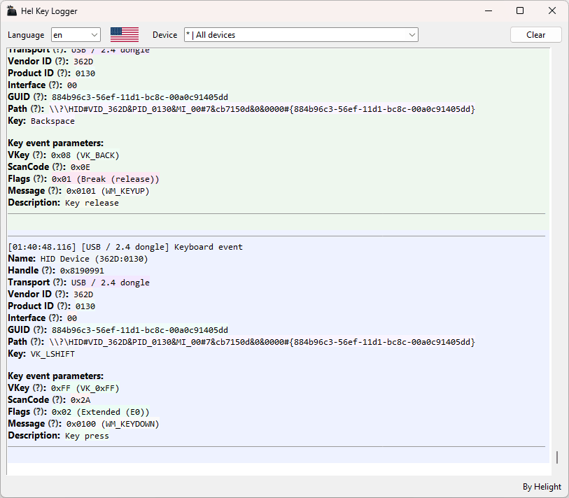

# Hel Key Logger

A tiny Windows utility that logs input events from keyboards / HID devices and shows **which key/button was pressed**, **from which device**, and **how Windows sees it**.

✅ Not spyware.  
This tool does **not** record passwords, screen contents, or network traffic. It simply displays raw input events in a local window for debugging.

---

## What it does

- Logs **Raw Input** events (Keyboard + HID / Consumer Controls).
- Shows **device details**:
  - Friendly device name (via SetupAPI, when available)
  - Transport hint (USB / Bluetooth / HID over GATT / “USB or 2.4 dongle”)
  - VID / PID and HID usage info (when available)
- Supports a **device filter** (show events only from the selected device).
  New translations can be added by dropping a `*.json` file into the `i18n/` folder.

---

## When it’s useful

- Checking whether a “special” key actually sends anything to Windows
- Verifying which physical device is generating an input event
- Troubleshooting USB vs Bluetooth vs dongle input behavior

---

## Requirements

- Windows 10/11
- Python 3.10+ recommended (should work on 3.9+ in most cases)
- Tkinter (usually included with standard Python on Windows)

---

## [Latest release](https://github.com/helight59/hel-key-logger/releases)

## Screenshots



---

## Run (from source)

### 1) Install Python

Install Python and make sure **“Add Python to PATH”** is enabled during installation.

Verify Python:

```powershell
py --version
```

### 2) Open Terminal in the project folder

Open the folder with the project (where `main.py` is located), then:

- Click the address bar in File Explorer
- Type `powershell`
- Press Enter

### 3) (Recommended) Create and use a virtual environment

Create `.venv`:

```powershell
py -m venv .venv
```

Activate it:

```powershell
.\.venv\Scripts\Activate.ps1
```

If Windows blocks activation, allow it once:

```powershell
Set-ExecutionPolicy -Scope CurrentUser RemoteSigned
```

### 4) Run the app

```powershell
py main.py
```

---

## Build a standalone `.exe` (PyInstaller)

This creates a single `.exe` file you can run without Python installed.

### 1) Install PyInstaller (inside the venv)

Activate the venv:

```powershell
.\.venv\Scripts\Activate.ps1
```

Install:

```powershell
py -m pip install --upgrade pip
py -m pip install pyinstaller
```

Verify:

```powershell
py -m PyInstaller --version
```

### 2) Build (one file, no console window)

```powershell
py -m PyInstaller --noconfirm --clean --onefile --windowed --name "Hel Key Logger" --icon "assets\app.ico" --add-data "i18n;i18n" --add-data "assets;assets" main.py
```

Output:

- `dist\Hel Key Logger.exe`

> If your project does not have an `assets/` folder, remove `--add-data "assets;assets"`  
> and also remove the `--icon ...` flag.

### 3) (Debug option) Build as a folder

If something is missing (translations/icons), building as a folder makes it easy to inspect files:

```powershell
py -m PyInstaller --noconfirm --clean --windowed --name "Hel Key Logger" --icon "assets\app.ico" --add-data "i18n;i18n" --add-data "assets;assets" main.py
```

Output folder:

- `dist\Hel Key Logger\`

---

## Translations

- All translations live in `i18n/` as `*.json`
- Add a new language by dropping a new JSON file into `i18n/`
- The app picks the system language by default and allows switching from the dropdown at runtime
- Tooltip logic:
  - Use tooltip text from the selected language if available
  - Otherwise fallback to English
  - If not found in both, the `(?)` hint is not shown

---

## Troubleshooting

### “No module named PyInstaller”

You installed PyInstaller into a different Python environment. Activate the venv and install again:

```powershell
.\.venv\Scripts\Activate.ps1
py -m pip install pyinstaller
```
